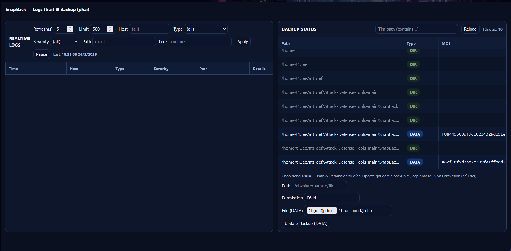
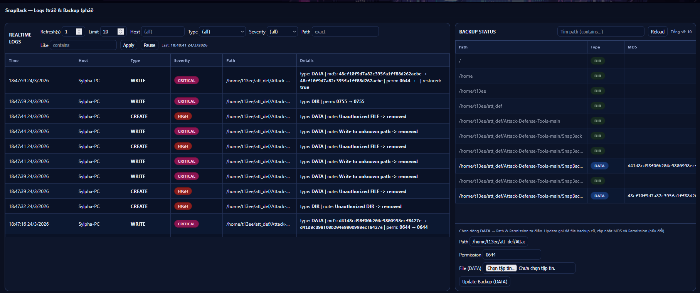

# SnapBack 🛡️

<p align="center">
  
  
  
  
</p>

<p align="center">
  <b>Công cụ bảo vệ hệ thống tự động dành cho Attack-Defense CTF</b><br/>
  Tự động backup, giám sát toàn vẹn file và restore tức thì khi bị tấn công.
</p>

---

## 📸 Giao diện





## 📖 Giới thiệu

SnapBack là hệ thống **backup & integrity enforcement** thời gian thực. Trong các giải Attack-Defense CTF, đối thủ liên tục tấn công service của bạn — SnapBack tự động phát hiện mọi thay đổi trái phép và **restore file về trạng thái sạch trong vài mili-giây**.

Hệ thống gồm hai thành phần:

- **`Server.go`** — Lưu trữ file backup, metadata và log sự kiện. Cung cấp Web UI để theo dõi.
- **`SnapBack.go`** — Agent chạy trên máy cần bảo vệ, giám sát file system và tự động enforce.

---

## 🏗️ Kiến trúc

```
┌──────────────────────────┐          ┌─────────────────────────────┐
│      SnapBack Agent      │          │       SnapBack Server       │
│  (chạy trên máy target)  │          │   (chạy trên máy riêng)     │
│                          │          │                             │
│  ┌─────────────────────┐ │─POST /─  │  ┌──────────────────────┐   │
│  │  fsnotify watcher   │ │          │  │  backup_file.json    │   │
│  │  (CREATE/WRITE/     │ │<GET /──  │  │  + backups/ (blobs)  │   │
│  │   REMOVE/CHMOD)     │ │          │  └──────────────────────┘   │
│  └─────────────────────┘ │          │                             │
│  ┌─────────────────────┐ │─POST───> │  ┌──────────────────────┐   │
│  │  Snapshot Poll      │ │  /log    │  │  Log Store (RAM)     │   │
│  │  (mỗi 5 giây)       │ │          │  │  tối đa 100k events  │   │
│  └─────────────────────┘ │          │  └──────────────────────┘   │
│  ┌─────────────────────┐ │          │                             │
│  │  Micro Sweep (1ms)  │ │          │  Web UI :1413/ui            │
│  └─────────────────────┘ │          └─────────────────────────────┘
└──────────────────────────┘
```

---

## ✨ Tính năng

- **Real-time watcher** — `fsnotify` bắt sự kiện `CREATE`, `WRITE`, `REMOVE`, `RENAME`, `CHMOD` tức thì
- **Snapshot polling** — Đồng bộ whitelist file từ server mỗi 5 giây
- **Micro sweep** — Quét mỗi 1ms để diệt file lạ trong các thư mục đang giám sát
- **Full sweep** — Khôi phục toàn bộ file bị thiếu hoặc thay đổi
- **Symlink attack prevention** — Phát hiện và vô hiệu hóa tấn công symlink
- **Self-protect** — Tự bảo vệ binary `SnapBack` khỏi bị xóa/ghi đè
- **RAM cache** — Cache blob backup tối đa 64MB, giảm độ trễ restore
- **Tập trung log** — Ghi log tất cả sự kiện với severity: `SAFE` / `LOW` / `MEDIUM` / `HIGH` / `CRITICAL`
- **Web UI** — Dashboard xem log thời gian thực và quản lý backup

---

## 🚀 Cài đặt

### Yêu cầu

- Go 1.19+
- OS: Linux (khuyến nghị)

### Clone & Build

```bash
git clone https://github.com/<your-username>/snapback.git
cd snapback

# Tải dependencies
go mod download

# Build Server
go build -o SnapBackServer Server.go

# Build Agent
go build -o SnapBack SnapBack.go
```

### Dependencies (`go.mod`)

```
module snapback

go 1.19

require github.com/fsnotify/fsnotify v1.9.0

require golang.org/x/sys v0.13.0 // indirect
```

---

## ⚡ Sử dụng nhanh

### Bước 1 — Khởi động Server (máy backup)

```bash
./SnapBackServer \
  -backup_host 0.0.0.0 \
  -backup_port 1412 \
  -log_host 0.0.0.0 \
  -log_port 1413
```

> Truy cập Web UI: `http://<server_ip>:1413/ui`

### Bước 2 — Khởi động Agent (máy target)

```bash
./SnapBack \
  -url http://<server_ip>:1412 \
  -log_url http://<server_ip>:1413 \
  -pil "/var/www/html,/etc/nginx/nginx.conf,/home/ctf/service" \
  -pel "/tmp,/var/log" \
  -cache_mb 64
```

Agent sẽ tự động **seed** toàn bộ file lên server backup khi khởi động lần đầu.

---

## ⚙️ Tham số

### Agent — `SnapBack`

| Tham số | Mặc định | Mô tả |
|---------|----------|-------|
| `-url` | `http://localhost:1412` | URL server backup |
| `-log_url` | _(giống `-url`)_ | URL server log (có thể khác) |
| `-host` | `localhost` | Host server (dùng thay `-url`) |
| `-port` | `1412` | Port server |
| `-scheme` | `http` | Scheme (`http` / `https`) |
| `-pil` | **bắt buộc** | Danh sách path cần bảo vệ, phân cách bằng `,` |
| `-pel` | _(rỗng)_ | Danh sách path loại trừ, phân cách bằng `,` |
| `-cache_mb` | `64` | Dung lượng RAM cache blob (MB) |

### Server — `SnapBackServer`

| Tham số | Mặc định | Mô tả |
|---------|----------|-------|
| `-backup_host` | `0.0.0.0` | Host backup server |
| `-backup_port` | `1412` | Port backup server |
| `-log_host` | `0.0.0.0` | Host log/UI server |
| `-log_port` | `1413` | Port log/UI server |

---

## 🌐 API Reference

### Backup Server `:1412`

| Method | Endpoint | Mô tả |
|--------|----------|-------|
| `POST /` | Headers: `Path`, `Type-File`, `Permission-File`, `Md5` | Upload file backup |
| `GET /?filename=<n>` | — | Tải blob file backup |
| `GET /backup_file` | — | Lấy toàn bộ metadata JSON |
| `POST /update_backup` | Headers: `Path`, `Permission-File` | Cập nhật file DATA |

### Log / UI Server `:1413`

| Method | Endpoint | Query params | Mô tả |
|--------|----------|-------------|-------|
| `POST /log` | Body: JSON `LogEvent` | — | Ghi log sự kiện |
| `GET /logs` | — | `limit`, `host`, `type`, `severity`, `path`, `path_like` | Truy vấn log |
| `GET /ui` | — | — | Web dashboard |

---

## 📋 Cấu trúc Log Event

```json
{
  "ts_unix": 1721234567,
  "ts_iso": "2024-07-17T12:34:56+07:00",
  "host": "10.0.0.5",
  "event_type": "WRITE",
  "severity": "CRITICAL",
  "path": "/var/www/html/index.php",
  "file_type": "DATA",
  "old_md5": "abc123...",
  "new_md5": "def456...",
  "old_perm": "0644",
  "new_perm": "0777",
  "restored": true,
  "note": ""
}
```

### Mức độ nghiêm trọng

| Severity | Event | Ý nghĩa |
|----------|-------|---------|
| 🔴 `CRITICAL` | `WRITE` | File bị ghi đè |
| 🟠 `HIGH` | `CREATE` | File lạ được tạo |
| 🟡 `MEDIUM` | `REMOVE` | File bị xóa |
| 🔵 `LOW` | `CHMOD`, `SYMLINK` | Đổi quyền / symlink |
| 🟢 `SAFE` | `BACKUP_UPDATE` | Cập nhật backup hợp lệ |

---

## 📁 Cấu trúc dự án

```
snapback/
├── Server.go            # Source code backup & log server
├── SnapBack.go          # Source code agent
├── go.mod               # Go module definition
├── go.sum               # Dependency checksums
├── backups/             # Blob files (tự tạo khi chạy)
├── backup_file.json     # Metadata index (tự tạo khi chạy)
```

---

## 🏆 Chiến thuật Attack-Defense CTF

**Trước giải:**
1. Dựng `SnapBackServer` trên một máy riêng (hoặc máy admin của đội).
2. Khởi động `SnapBack` Agent trên tất cả máy target với `-pil` trỏ đến toàn bộ service.
3. Agent tự **seed** → server có bản backup sạch của mọi file.

**Trong giải:**
- Đối thủ sửa file → Agent phát hiện qua `fsnotify` / `micro sweep` → **restore trong vài ms**.
- Mọi sự kiện được log về server, theo dõi qua Web UI để nhận biết pattern tấn công.

**Khi cần patch:**
1. Upload file đã patch lên backup qua Web UI (**Update Backup**).
2. Deploy patch lên service.
3. Agent nhận bản mới từ server trong lần poll tiếp theo (tối đa 5 giây).

> ⚠️ **Quan trọng:** Luôn cập nhật backup **trước** khi sửa file trên service, tránh bị agent tự rollback patch của mình.

---

## ⚠️ Lưu ý

- Agent cần quyền đọc/ghi trên các path trong `-pil` (thường cần `root`).
- Nên mở port `1412` và `1413` giữa máy agent và server trong cấu hình network giải.
- `microSweepInterval = 1ms` đủ để block hầu hết script tấn công tự động.
- File backup được lưu tên ngẫu nhiên (MD5 prefix) để tránh bị đoán tên.
- Log server lưu **in-memory** (tối đa 100.000 entries), không persist qua restart.

---

## 📄 License

[MIT License](LICENSE) — Tự do sử dụng cho mục đích học tập và thi đấu CTF.

---

<p align="center">Made with ❤️ for CTF players</p>